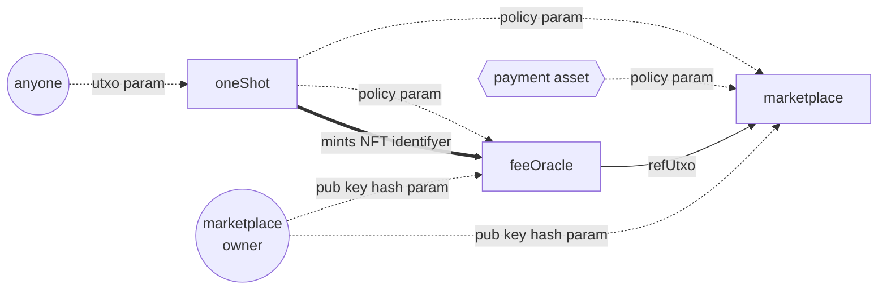

## Empowa ecosystem marketplace

```mermaid
flowchart LR
    oneShot
    feeOracle
    marketplace
    marketplace_owner((marketplace\nowner))
    anyone((anyone))
    token{{payment asset}}

    anyone -. utxo param .-> oneShot

    oneShot ==> |mints NFT identifyer| feeOracle
    oneShot -. policy param .-> feeOracle

    oneShot -. policy param .-> marketplace
    
    marketplace_owner -. pub key hash param .-> marketplace
    marketplace_owner -. pub key hash param .-> feeOracle

    feeOracle --> |refUtxo| marketplace
    
    token -. policy param .-> marketplace
```

## Docs

see the [`docs` folder](./docs/) for documentation