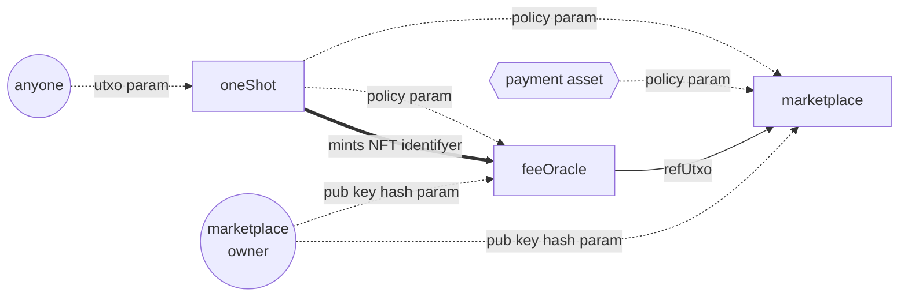

## Empowa ecosystem marketplace



## Docs

see the [`docs` folder](./docs/) for documentation

## Testing Suite

### 1. Install Required Packages

```bash
pnpm install
```

### 2. Provide Required Keys

You will need to have a `secret_testnet` folder at the root of the local repository, in which `.skey` (signing key) and `.vkey` (payment verification key) files are present in order to run the testing suite

### 3. Run Tests

```bash
pnpm run test-al
```


