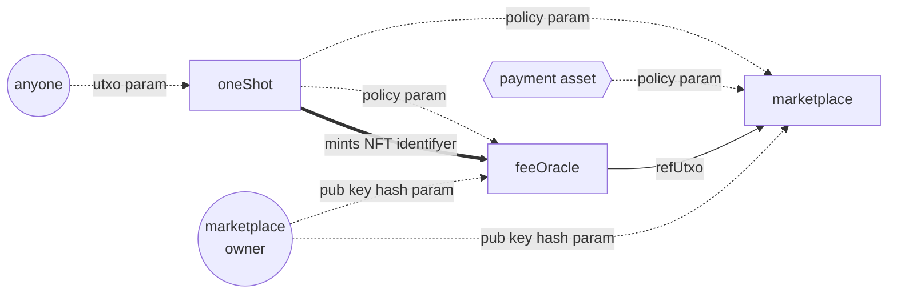

## Empowa ecosystem marketplace



## Docs

see the [`docs` folder](./docs/) for documentation

## Testing Suite

### 1. Install Required Packages

```bash
npm install

# or

pnpm install
```

### 2. Run Tests

```bash
npm run test-al

# or

pnpm run test-al
```


