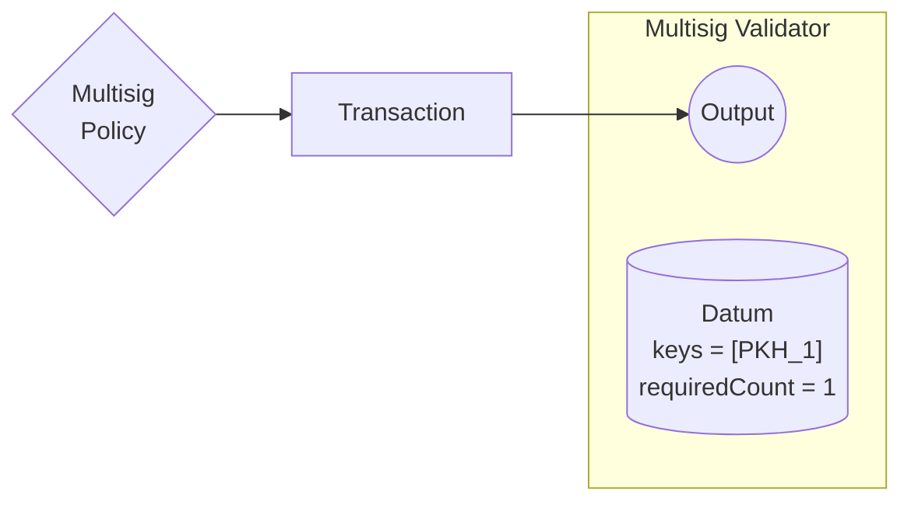
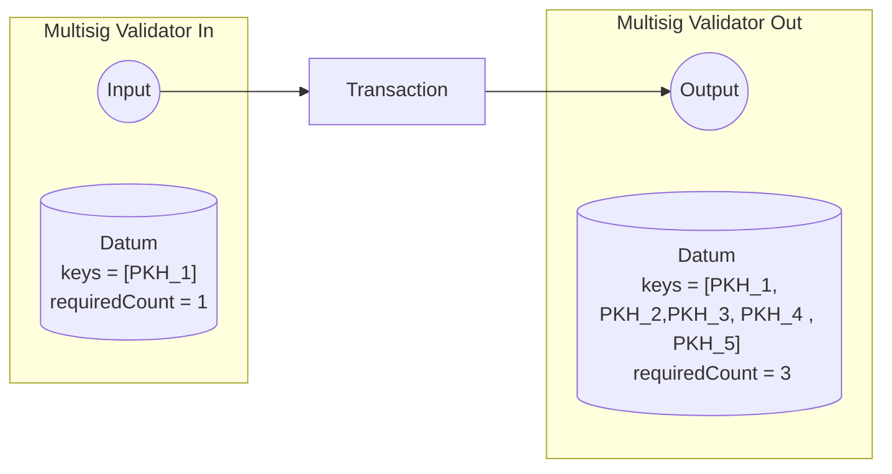
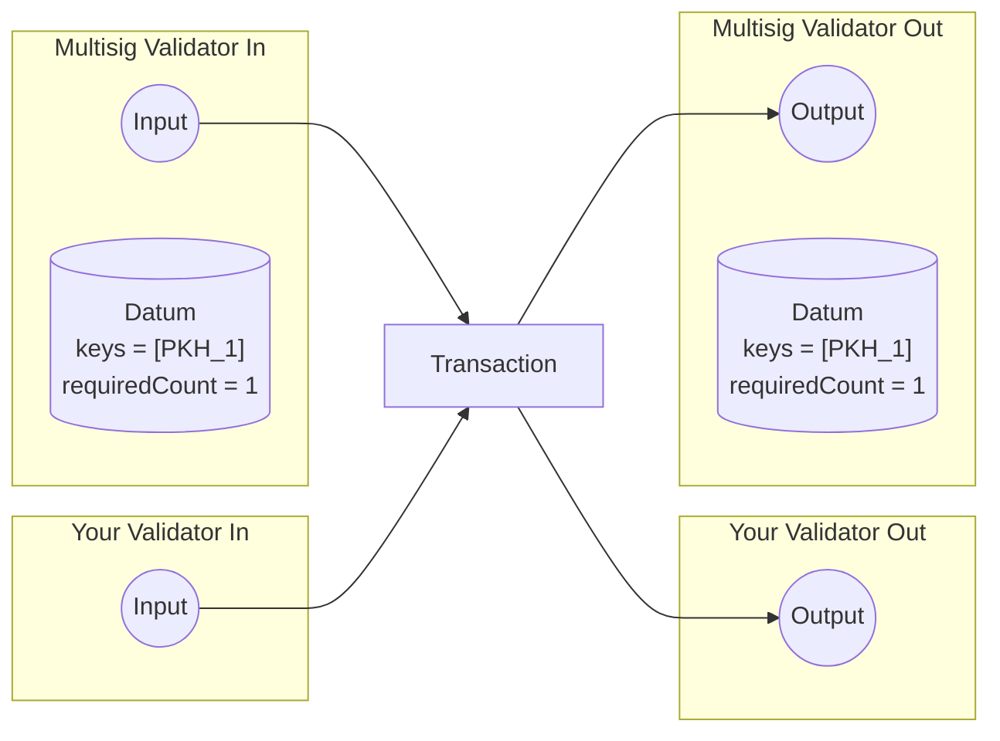

# Initial Setup
The Multisig Minting policy serves two main purposes:

- Ensures that the initial setup is correctly executed, with the output address as the multisig validator.
- Mints a unique Multisig NFT intended for locking within the multisig validator.

# Multisig Actions
The Multisig spending validator consists of two actions:

## Update
Allows for the addition or removal of members from the Multisig arrangement, and updates the required signers threshold, using `signedByAMajority` function

## Sign
This action ensures that the number of signers meets or exceeds the specified threshold, using `signedByAMajority` function.

The datum of the Multisig remains the same

Because the Multisig NFT is unique, you have the option to either parametrize the contract or set the Multisig policy in the your contract's datum as a Config.

In your contract, the only requirement is to confirm the presence of the NFT in the transaction.

