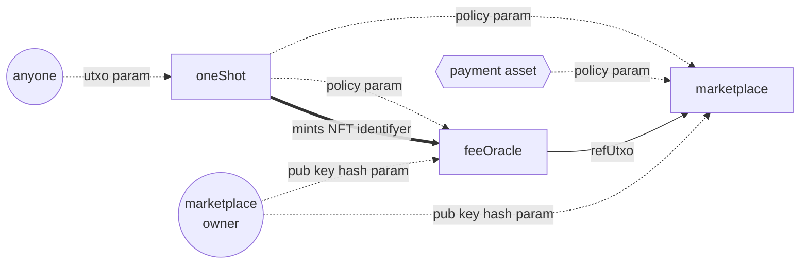

# Empowa ecosystem marketplace documentaiton

## Index

- [Install dependecies](#install-dependecies)
- [project_overview](#project-overview)
- [project_structure](./project_structure/README.md)

## Install dependecies

once you have this repo all the dependecies are already 

## Project overview

### What is this? Where am I?

this repository contains the source code for the Empowa ecosystem marketplace.

the project is organized mainly in two folders:

- the `src` folder
- the `app` folder

the above contains the actual contracts.

the latter includes some scripts to interact with the compiled contracts.

### Contracts interaction

the project consists of 3 contracts in total:

- the `oneShot` minting policy;
- the `feeOracle`
- the `marketplace`

as you can imagine the `marketplace` is the principal one.

the `feeOracle` is used to update the fee that the marketplace takes for each succesful buy
the fee can be updated indipendently by the marketplace and it can be done only by a predefined marketplace_owner

and finally the `oneShot` is a standard parametrized minting policy.

the interacitons are described in the chart above.